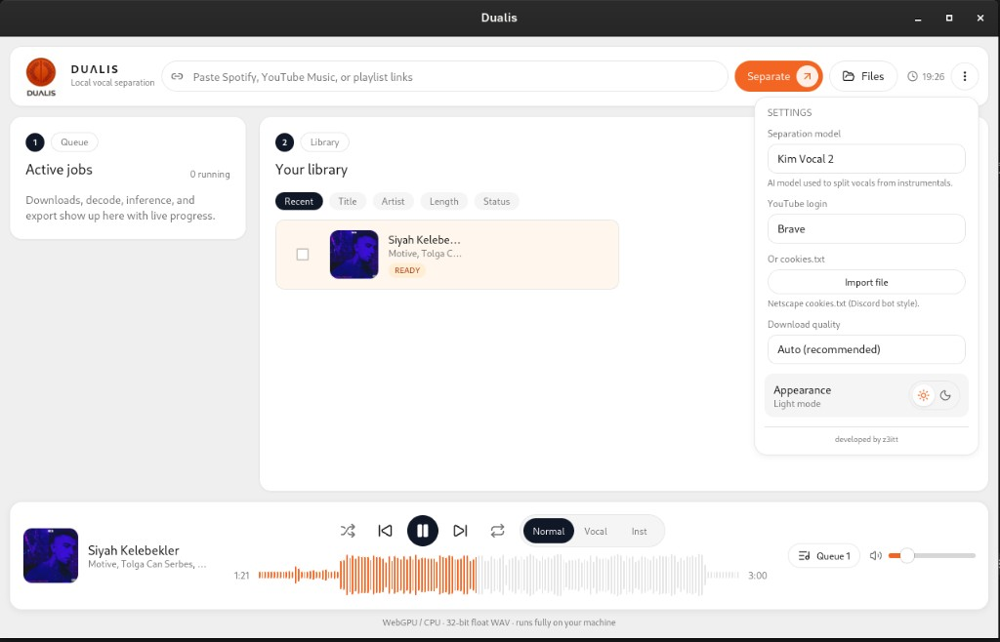
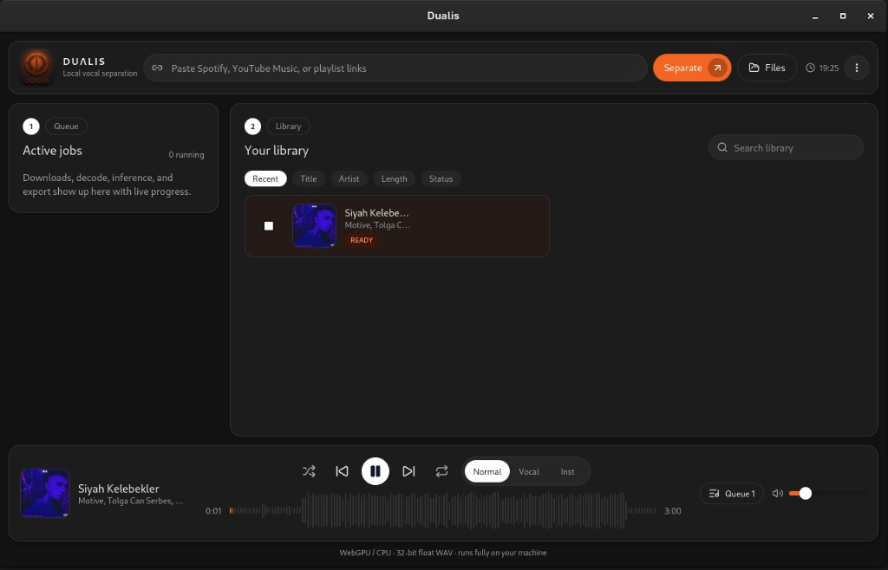
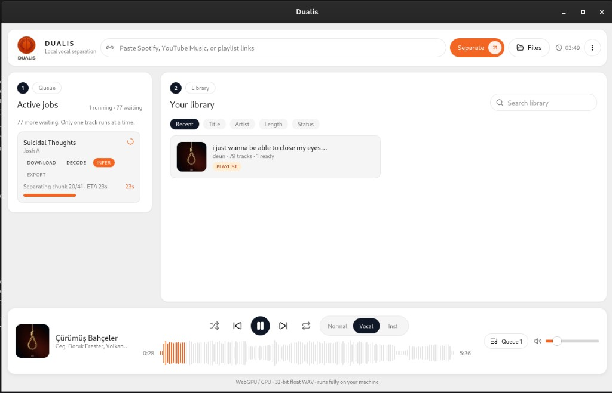
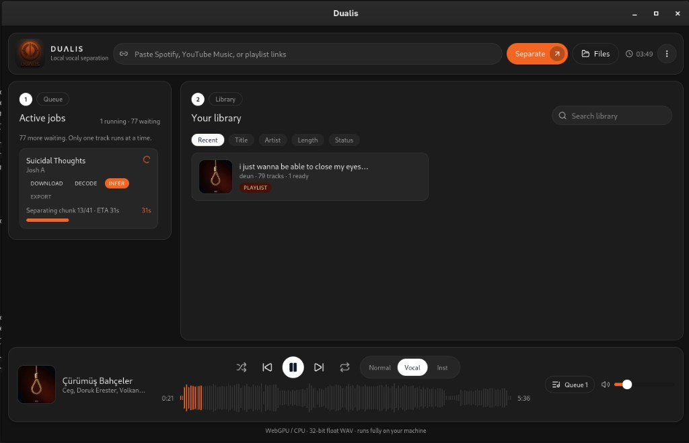

# Dualis for Android

On-device vocal and instrumental stem separation for phones and tablets.
Paste a Spotify, YouTube Music, or YouTube link, or open a local audio file.
Dualis downloads audio onto the device, splits vocals from the mix with ONNX,
and plays both stems in sync.

This is a **native Android sibling** of [desktop Dualis](https://github.com/z3itt/Dualis).
It is not a WebView or Tauri wrap of the desktop UI.

[](LICENSE)

| | |
|---|---|
| **applicationId** | `com.z3itt.dualis` |
| **Version** | `1.0.0` |
| **Desktop sibling** | Dualis 1.0.2 (`com.z3itt.dualis` on Linux/Windows) |
| **Distribution** | GitHub Releases + F-Droid only. **No Google Play Store.** |
| **License** | [GPL-3.0-or-later](LICENSE) |

The same applicationId is used on purpose: desktop and Android are different
package ecosystems (native installers vs APK). F-Droid and sideload builds
do not collide with the Tauri identifier.

Separation runs on the device. Audio is not uploaded to a Dualis server.

## Screenshots

Desktop 1.0.2 is the visual reference (same orange, panels, squircle mark):

| Library (light) | Library (dark) |
|-----------------|----------------|
|  |  |

| Job queue (light) | Job queue (dark) |
|-------------------|------------------|
|  |  |

## Architecture

```text
┌─────────────────────────────────────────────────────────────┐
│  Jetpack Compose (Dualis tokens, not stock Material purple) │
│  Library · job queue · dual-stem player · settings          │
└───────────────────────────┬─────────────────────────────────┘
                            │ ViewModel + SharedFlow
┌───────────────────────────▼─────────────────────────────────┐
│  Kotlin                                                     │
│  SAF ingest · NewPipe/YouTube · Room · ONNX · ExoPlayer     │
│  Work queue (one job) · foreground job + media services     │
└─────────────────────────────────────────────────────────────┘
```

Desktop Dualis uses a localhost HTTP WAV server because Linux WebKit is
unreliable. Android does **not** copy that. Stems are files in app storage
and two ExoPlayer instances stay in sync.

### Key design choices

| Area | Approach |
|------|----------|
| UI | Kotlin, Jetpack Compose, Material 3 recolored to Dualis tokens |
| Jobs | Single-thread `WorkQueue` + `JobForegroundService` (one download/separation at a time) |
| Spotify | oEmbed + page scrape, then YouTube search `ytsearch1:{title} {artist}` |
| Retry | Always uses stored `ytdlpQuery`, never the Spotify URL |
| Separation | ONNX MDX / Roformer on device (Kim Vocal 2 default) |
| Execution | NNAPI when it works, automatic CPU fallback on GPU/OOM errors |
| Playback | Two ExoPlayer instances, Media3 session, audio focus |
| Persistence | Room / SQLite (`tracks`, `playlists`, `settings`) |

## Build and run

### Requirements

- JDK 17 (Gradle toolchain can download it)
- Android SDK 35, build-tools 34+
- Android Studio or command-line `sdkmanager`
- minSdk 26 (Oreo): notification channels, MediaCodec extras, 64-bit-first devices

Set `sdk.dir` in `local.properties` (not committed):

```properties
sdk.dir=/home/you/Android/Sdk
```

### Debug APK

```bash
./gradlew assembleDebug
# APK: app/build/outputs/apk/debug/app-debug.apk
# debug applicationId is com.z3itt.dualis.debug
```

### Release APK (unsigned)

```bash
./gradlew assembleRelease
```

Install on a device or emulator (API 26+). Grant notifications if prompted
so job progress stays visible.

### Tests

```bash
./gradlew testDebugUnitTest
```

Unit tests cover the Spotify query builder, retry query resolution, queue
ordering, library sort/stage chips, and CPU-fallback error strings.

## First run

The first stem job downloads **Kim Vocal 2** (`Kim_Vocal_2.onnx`, about 60-80 MB)
into app files. Keep the screen on or let the foreground notification run.

## Performance expectations

These numbers match desktop Dualis, on phone hardware:

| Device class | 3-4 min song |
|--------------|----------------|
| Mid-range, CPU only | about 8-20 minutes |
| Flagship with NNAPI | about 2-6 minutes possible |
| Long songs + BS-Roformer | may OOM on low-RAM phones |

If NNAPI or GPU-style providers fail, Dualis retries on CPU and shows
"GPU memory exhausted, retrying on CPU" or "GPU inference failed, retrying on CPU".

## Download backends

`DownloadBackend` is an interface:

| Backend | Role |
|---------|------|
| `LocalFileBackend` | SAF picker + share intent `audio/*` (MVP) |
| `LinkBackend` | YouTube via [NewPipe Extractor](https://github.com/TeamNewPipe/NewPipeExtractor) (FOSS Java). Spotify metadata via oEmbed/scrape, then YouTube search using the stored `ytsearch1:` query. |

Android does not spawn a desktop `yt-dlp` sidecar. Bundling a Python/yt-dlp
binary would fight SELinux, ABI splits, and F-Droid reproducible builds.
NewPipe Extractor is the F-Droid-friendly stand-in. F-Droid maintainers should
**vendor** that library from source instead of resolving JitPack at build time.

Share intents: `audio/*` files and `text/plain` URLs.

## F-Droid notes

- No Play Store, no Firebase, no proprietary Google Play Services
- ONNX Runtime Android is MIT
- ExoPlayer / Media3 is Apache 2.0
- NewPipe Extractor is GPL-3.0-compatible
- Skeleton metadata: `metadata/com.z3itt.dualis.yml`
- AntiFeatures to consider: `NonFreeNet` (YouTube/Spotify/model hosts when the user pastes a link or the app fetches a model)
- Models are downloaded at runtime, not redistributed in the APK

## Models

Pick a model in the header menu:

- **Kim Vocal 2** (MDX, default)
- **UVR MDX Voc FT** (MDX, alternate timbre)
- **BS-Roformer** (waveform ONNX; input shape is read from the file)

## Project layout

```text
app/src/main/java/com/z3itt/dualis/
  ui/          Compose screens and Dualis theme tokens
  domain/      Spotify query, queue, library, playback rules
  data/        Room + repository
  audio/       Decode, WAV I/O, dual ExoPlayer
  ml/          ONNX catalog, STFT, separator
  download/    Local + link backends
  service/     Foreground job + media session
metadata/      F-Droid skeleton
docs/screenshots/  Desktop visual reference
```

## Privacy

Dualis talks to Spotify oEmbed, YouTube (via NewPipe Extractor), and model
download hosts only when you paste a link or fetch a model. Stems stay under
app storage (`com.z3itt.dualis`). There is no Dualis cloud account.

## License

Copyright (C) 2026 z3itt <info@z3itt.com>

GPL-3.0-or-later. See [LICENSE](LICENSE), [COPYING](COPYING), and [NOTICE](NOTICE).

## Contact

- **Author:** z3itt
- **Email:** info@z3itt.com
- **Website:** https://z3itt.com
- **Desktop source:** https://github.com/z3itt/Dualis
