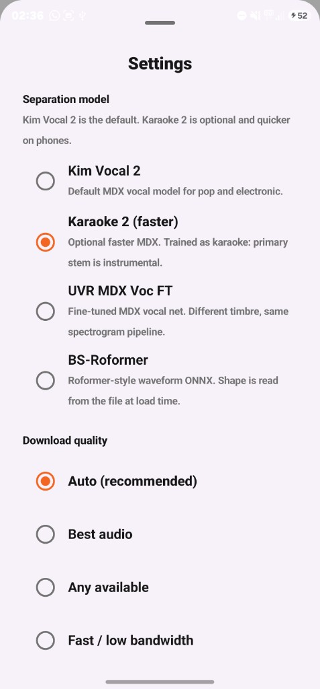
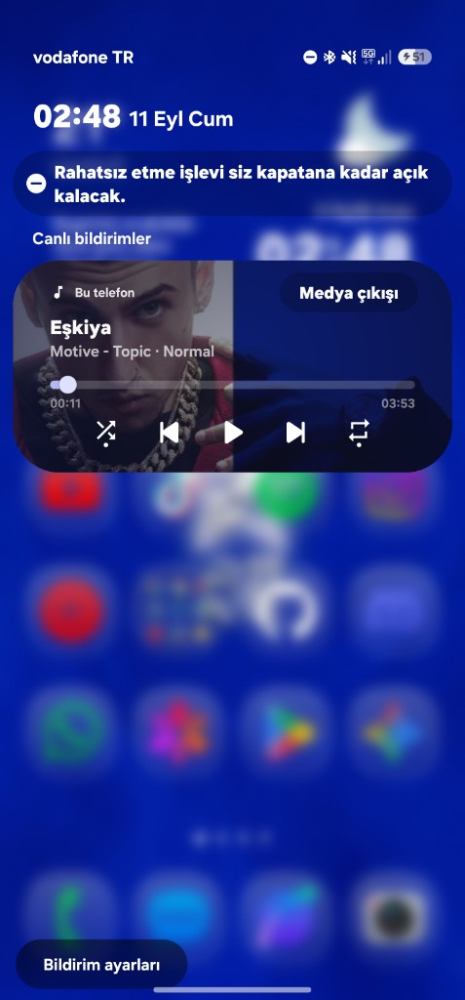
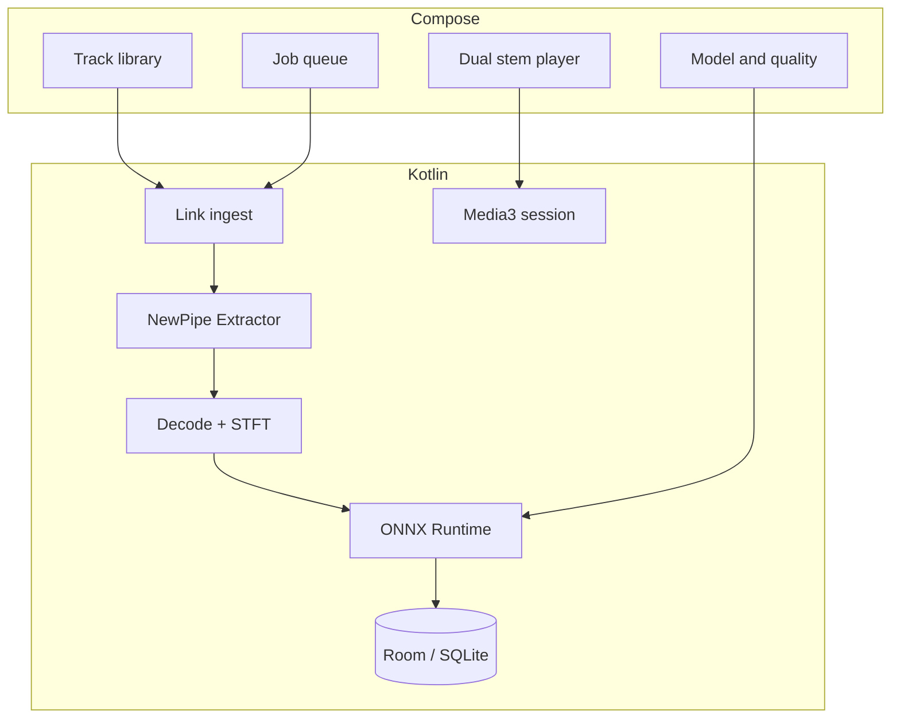

# Dualis for Android

**Dualis for Android** is a local audio processing engine for phones and
tablets. It separates vocals and instrumentals on the device with ONNX, then
plays both stems in sync (Jetpack Compose, NNAPI or CPU).

Provide a URL or share a local audio file: fetch, separation, and playback stay
on the device. Nothing is uploaded to a Dualis server.

This is a **native Android sibling** of [desktop Dualis](https://github.com/z3itt/Dualis).
It is not a WebView or Tauri wrap of the desktop UI.

[](LICENSE)

| | |
|---|---|
| **Package** | `com.z3itt.dualis` |
| **Version** | `1.0.0` |
| **Min SDK** | 26 (Android 8.0) |
| **Target SDK** | 35 |
| **Distribution** | GitHub Releases, F-Droid |
| **Desktop sibling** | Dualis for Linux and Windows |
| **License** | [GPL-3.0-or-later](LICENSE) |

Dualis is free software. You may study, modify, and redistribute it under the
terms of the GNU General Public License v3. See [LICENSE](LICENSE),
[COPYING](COPYING), [NOTICE](NOTICE), and [ATTRIBUTION.md](ATTRIBUTION.md).

There is no Play Store build and no Google Play Services requirement. The same
applicationId is used on purpose: desktop and Android are different package
ecosystems (native installers vs APK), so F-Droid and sideload builds do not
collide with the Tauri identifier.

## Highlights

- Local ONNX vocal isolation (Kim Vocal 2 by default; Karaoke 2 is faster)
- Dual-stem player: original, vocals, or instrumental
- Shuffle, queue loop, and song loop
- System media notification and lock-screen mini player
- NNAPI when it works, then CPU. Accelerator errors retry on CPU
- **Link ingest:** Spotify, YouTube Music, YouTube, or playlist URLs you provide
- Share `audio/*` files or open them from the library
- Spotify metadata resolves to a public video search (**title + artist**)
- One job at a time: ingest, decode, ONNX inference, then export

## Responsible use

Dualis is a personal tool for on-device audio processing. You are responsible
for how you use it.

- Use only content you have the right to process (your files, licensed material,
  or other cases where you have permission).
- Third-party platforms have their own terms; complying with them is your
  responsibility.
- Dualis does not host, stream, or redistribute music. It runs locally on your
  device.
- The project is not intended to encourage copyright infringement.

## Screenshots

| Library (light) | Library (dark) |
|-----------------|----------------|
|  |  |

| Job queue (light) | Job queue (dark) |
|-------------------|------------------|
|  |  |

| Settings | System mini player |
|----------|--------------------|
|  |  |

## Architecture

```text
┌─────────────────────────────────────────────────────────────┐
│  :app                                                       │
│  Jetpack Compose (Dualis tokens, not stock Material purple) │
│  Library · job queue · dual-stem player · settings          │
└───────────────────────────┬─────────────────────────────────┘
                            │ ViewModel + SharedFlow
┌───────────────────────────▼─────────────────────────────────┐
│  Kotlin                                                     │
│  SAF ingest · NewPipe / YouTube · Room · ONNX · ExoPlayer   │
│  Work queue (one job) · foreground job + media services     │
└─────────────────────────────────────────────────────────────┘
```



Desktop Dualis uses a localhost HTTP WAV server because Linux WebKit is
unreliable. Android does **not** copy that. Stems are files in app storage
and two ExoPlayer instances stay in sync.

### Key design choices

| Area | Approach |
|------|----------|
| UI | Compose + Material 3, Dualis tokens |
| State | `StateFlow` / `SharedFlow` in `DualisViewModel` |
| Jobs | `WorkQueue` + `JobForegroundService` |
| Link metadata | oEmbed + scrape, then a public video search |
| Retry | Stored `ytdlpQuery`, never the Spotify URL |
| Separation | ONNX MDX / Roformer on device |
| Execution | NNAPI when available, CPU fallback |
| Playback | Two ExoPlayer instances, Media3 session |
| Persistence | Room / SQLite |

The work queue is single-threaded, so one download or separation runs at a
time. Spotify tracks are searched on YouTube as `ytsearch1:{title} {artist}`,
and a retry reuses that stored query instead of the Spotify URL. Room holds
`tracks`, `playlists`, and `settings`.

## Tech stack

| Layer | Libraries |
|-------|-----------|
| Language | Kotlin 2.0 |
| UI | Jetpack Compose, Material 3 |
| Database | Room 2.6 |
| Async | Kotlin Coroutines, Flow |
| Playback | Media3 ExoPlayer + Session 1.5 |
| Inference | ONNX Runtime Android 1.22 |
| Download | NewPipe Extractor, OkHttp, Jsoup |
| DSP | JTransforms 3.1 |
| Build | AGP 8.7, Gradle 8.11.1, JDK 17 |

## Privacy and permissions

Dualis talks to Spotify oEmbed, YouTube (via NewPipe Extractor), and model
download hosts only when you paste a link or fetch a model. Stems stay under
app storage (`com.z3itt.dualis`). There is no Dualis cloud account.

| Permission | Why |
|------------|-----|
| `INTERNET` | Link ingest, model download |
| `ACCESS_NETWORK_STATE` | Connectivity checks |
| `FOREGROUND_SERVICE` | Job and playback services |
| `FOREGROUND_SERVICE_DATA_SYNC` | Job progress |
| `FOREGROUND_SERVICE_MEDIA_PLAYBACK` | Audio after lock |
| `POST_NOTIFICATIONS` | Progress, media controls |
| `WAKE_LOCK` | Playback with screen off |
| `WRITE_EXTERNAL_STORAGE` | Legacy export, API 28 and below |

Share intents: `audio/*` files and `text/plain` URLs.

## Getting started

### Requirements

- Android Studio Ladybug or newer (or compatible IDE)
- **JDK 17** for Gradle (Gradle 8.11.1 does not run on JDK 25)
- Android SDK with API 35 platform tools
- Device or emulator on API 26+

Set `sdk.dir` in `local.properties` (not committed):

```properties
sdk.dir=/home/you/Android/Sdk
```

### Install (release)

Download the latest APK from
[GitHub Releases](https://github.com/z3itt/Dualis-for-Android/releases).

### Clone and run (debug)

```bash
git clone https://github.com/z3itt/Dualis-for-Android.git
cd Dualis-for-Android
```

Open the project in Android Studio, set **Gradle JDK** to 17, sync, then Run.

Or from the terminal:

```bash
export JAVA_HOME="$HOME/.jdks/temurin-17.0.20.1"   # or your JDK 17 path
./gradlew :app:installDebug
```

Debug `applicationId` is `com.z3itt.dualis.debug`.

### Tests

```bash
./gradlew testDebugUnitTest
```

Unit tests cover the Spotify query builder, retry query resolution, queue
ordering, library sort/stage chips, CPU-fallback error strings, and related
inference helpers.

See [CONTRIBUTING.md](CONTRIBUTING.md) for signed release builds and distribution
channels.

## First run

The first stem job downloads **Kim Vocal 2** (`Kim_Vocal_2.onnx`, about 60-80 MB)
into app files. Keep the screen on or let the foreground notification run.

## Performance expectations

These numbers match desktop Dualis, on phone hardware:

| Device class | 3-4 min song |
|--------------|--------------|
| Mid-range, CPU only | 8-20 minutes |
| Flagship with NNAPI | 2-6 minutes |
| Long songs, BS-Roformer | may run out of RAM |

If QNN or NNAPI fail, Dualis retries on CPU and shows
"GPU memory exhausted, retrying on CPU" or "Accelerator failed, retrying on CPU".

## Ingest backends

`DownloadBackend` has two implementations (local files vs remote URL ingest):

- **`LocalFileBackend`** takes files from the SAF picker and from `audio/*`
  share intents.
- **`LinkBackend`** fetches audio from supported URLs through
  [NewPipe Extractor](https://github.com/TeamNewPipe/NewPipeExtractor), a FOSS
  Java library. Spotify URLs go through oEmbed or a page scrape for metadata,
  then a public video search using the stored `ytsearch1:` query.

Android does not spawn a desktop `yt-dlp` sidecar. Bundling a Python/yt-dlp
binary would fight SELinux, ABI splits, and F-Droid reproducible builds.
NewPipe Extractor is the F-Droid-friendly stand-in. F-Droid maintainers should
**vendor** that library from source instead of resolving JitPack at build time.

## Models

Pick a model in Settings:

- **Kim Vocal 2** (MDX, default)
- **Karaoke 2 (faster)** (optional smaller MDX, same overlap)
- **UVR MDX Voc FT** (MDX, alternate timbre)
- **BS-Roformer** (waveform ONNX; input shape is read from the file)

Models are downloaded at runtime, not redistributed in the APK.

## F-Droid notes

- No Play Store, no Firebase, no proprietary Google Play Services
- ONNX Runtime Android is MIT
- ExoPlayer / Media3 is Apache 2.0
- NewPipe Extractor is GPL-3.0-compatible
- Skeleton metadata: `metadata/com.z3itt.dualis.yml`
- AntiFeature to consider: `NonFreeNet`, for YouTube, Spotify, and model hosts

## Project layout

```text
app/src/main/java/com/z3itt/dualis/
  ui/          Compose screens and Dualis theme tokens
  domain/      Spotify query, queue, library, playback rules
  data/        Room + repository
  audio/       Decode, WAV I/O, dual ExoPlayer, playback hub
  ml/          ONNX catalog, STFT, separator
  download/    Local + link backends
  service/     Foreground job + media session
metadata/      F-Droid skeleton
docs/screenshots/  README screenshots
```

## Contributing

Dualis is GPL-3.0. See [CONTRIBUTING.md](CONTRIBUTING.md) for setup, signing,
distribution, and pull request guidelines.

## Contact

- **Author:** z3itt
- **Email:** info@z3itt.com
- **Website:** https://z3itt.com
- **Source:** https://github.com/z3itt/Dualis-for-Android
- **Desktop source:** https://github.com/z3itt/Dualis
